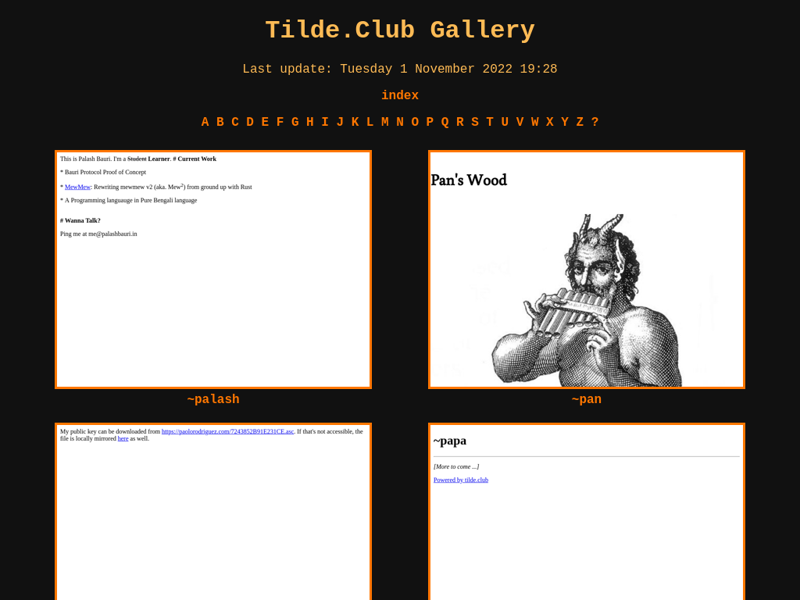

# Tildeverse Gallery

Code and templates used to take screenshots and generate HTML for the gallery
on:
- [tilde.club](https://tilde.club/~gallery)
- [tilde.town](https://tilde.town/~tweska)
- [tilde.cafe](https://tilde.cafe/~tweska/gallery)



## Requirements
The requirements should be installed on the system before you can run the
scraper. These can be installed with the following commands:
```
apt install libxss1 libatk-bridge2.0-0 libgtk-3-0
apt install fonts-liberation
pip install -r requirements.txt
```

The update script assumes that a python virtual environment is used named `env`.
Create a new virtual environment first using this command:
```
python3 -m venv env
```

## Update pipeline
The program follows the following update pipeline:
```
            start
              |
              V
+---------------------------+
|  Get users & timestamps   |
|    from remote server.    |
+---------------------------+
              |
              V
+---------------------------+
|  Merge with cached data.  |
+---------------------------+
              |
              V
+---------------------------+
|      Update outdated      |
|       screenshots.        |
+---------------------------+
              |
              V
+---------------------------+
|  Generate & zip website.  |
+---------------------------+
              |
              V
+---------------------------+
|   Send to remote server   |
|        and unzip.         |
+---------------------------+
```
